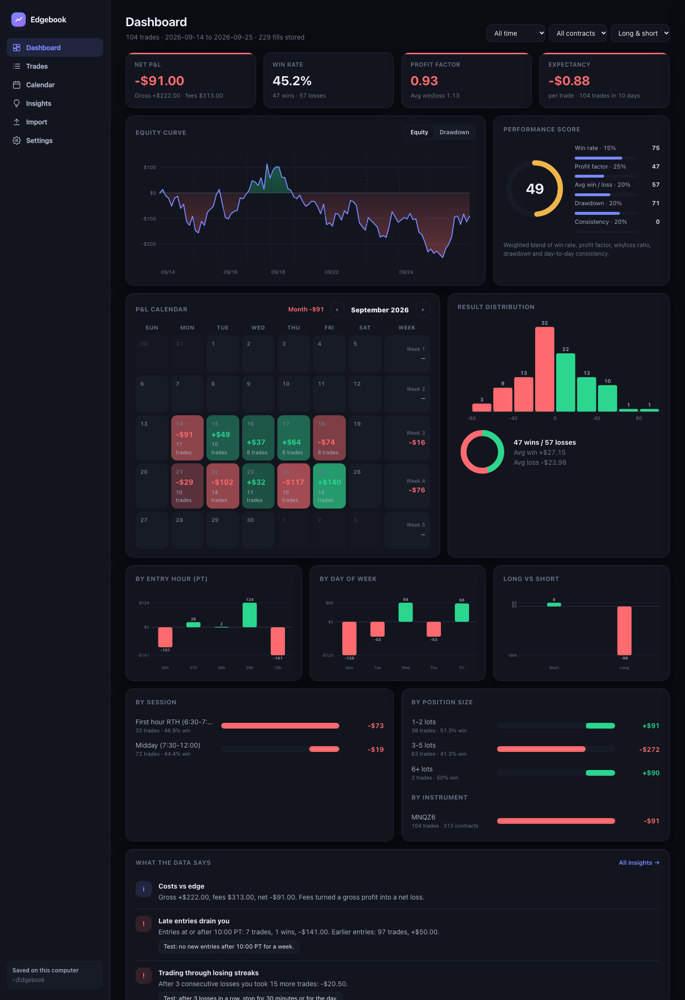
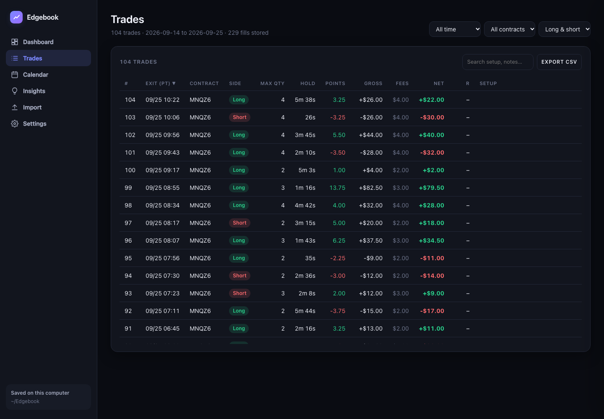
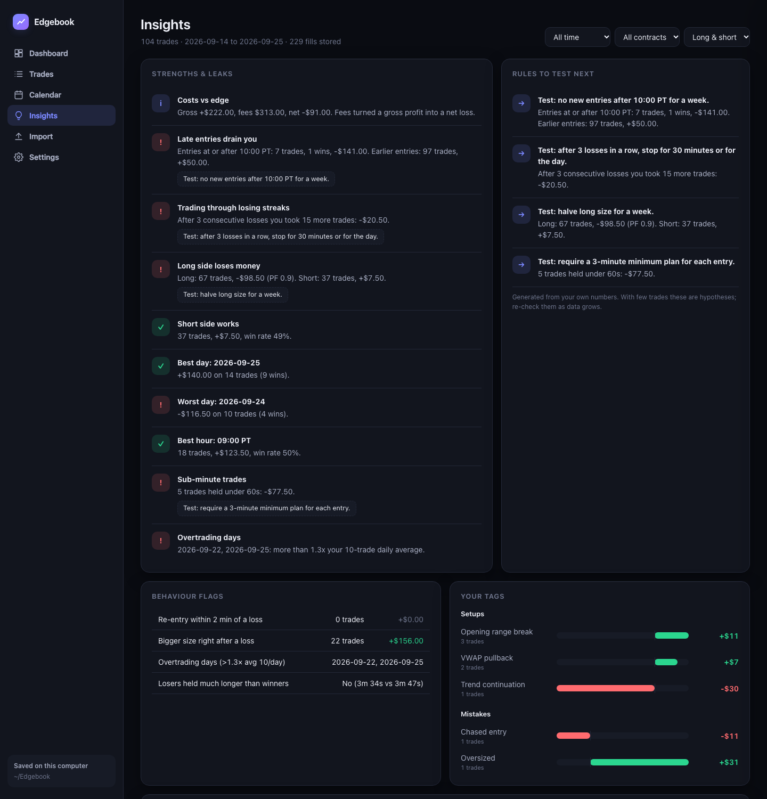
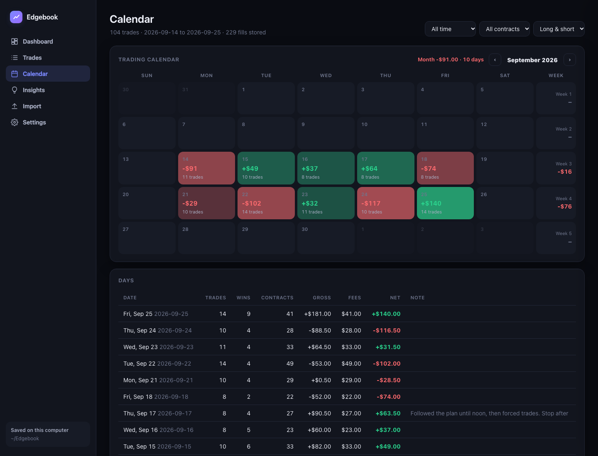

# Edgebook

**A local-first trading journal for futures traders.** Drop in your Tradovate exports, get a Tradezella-style performance review, and keep your notes, setups and mistakes on your own machine. No account, no cloud, no dependencies.



> Screenshots use synthetic demo data from `samples/`, not real trades.

## Why I built it
I wanted to understand my own trading without handing my fills to a subscription service. Tradovate's exports have everything needed to rebuild every trade exactly, so Edgebook does that and then adds the part software usually skips: a place to record *why* you took each trade and what went wrong.

## Features
- **Exact trade rebuild.** FIFO pairing per contract from flat to flat, with scale-ins, scale-outs, partial fills and reversals. P&L uses real per-fill commissions, so net P&L matches the broker.
- **Reconciliation.** Import Tradovate's Performance report and Edgebook compares gross P&L against its own rebuild day by day.
- **Dashboard.** Equity and drawdown curves, P&L calendar with week totals, result distribution, and breakdowns by hour, weekday, long vs short, session, position size and instrument. A 0-100 performance score shows its formula.
- **Insights that cite your numbers.** Late-session bleed, trading through losing streaks, trading past a daily loss limit, weak side, sub-minute scalps, re-entries after a loss. Each leak comes with a rule you can test.
- **Journal.** Per trade: setup, mistake tag, planned risk (gives R-multiples), rating, notes. Per day: mood and daily notes. Tag stats show which setups and mistakes actually pay or cost you.
- **Your data stays yours.** Everything lives in `~/Edgebook` (SQLite plus an always-fresh `trade_log.csv` and rolling backups). The server binds to `127.0.0.1` only.
- **Pacific time and CME trade dates** by default, matching Tradovate's own calendar. Light/dark themes and a colour-blind-friendly palette.

| Trades and journal | Insights | Calendar |
|---|---|---|
|  |  |  |

## Quick start
Requires Python 3.9+ and nothing else.

```bash
git clone https://github.com/amanubhi/edgebook.git
cd edgebook
python3 -m edgebook          # opens http://127.0.0.1:8765
```
On macOS you can also double-click **Start Edgebook.command**.

Want to look around first? Open the **Import** page and drop in `samples/sample_fills.csv` and `samples/sample_performance.csv`.

### Using your own data
In Tradovate, export **Fills** (required) and **Performance** (optional, for the cross-check) as CSV, then drop them on the Import page. Re-importing overlapping files is safe because fills are de-duplicated by Fill ID.

Other options: `python3 -m edgebook --data /path/to/folder --port 9000 --no-browser`.

## How trades are built
1. Fills are ordered by exchange timestamp and grouped per account and contract.
2. A trade starts when the position leaves flat and ends when it returns to flat. A fill that flips the position closes one trade and opens the next.
3. Exits are matched to entries FIFO. Gross P&L = price difference x point value x contracts. Fees are the real per-fill commissions, allocated to the contracts they cover.
4. Day totals use the CME trade date (the session rolls at 2 pm Pacific), the same as Tradovate's calendar.

Point values for ES, MES, NQ, MNQ, YM, MYM, RTY, M2K, CL, MCL, GC and MGC are built in; add others in Settings.

## Project layout
```
edgebook/
  engine.py     parsing, SQLite schema, FIFO trade builder, analytics, insights
  server.py     stdlib HTTP server + JSON API (import, notes, backup, export)
  static/       single-page UI: plain JS, hand-rolled SVG charts, no build step
samples/        synthetic data generator and sample CSVs
tests/          unit tests for the trade builder and metrics
```

```bash
python3 -m unittest discover tests     # run the tests
python3 samples/make_sample_data.py    # regenerate the demo data
```

## Limits
- Built around Tradovate's CSV format. Other brokers would need a parser in `engine.import_text`.
- Fills alone cannot show MAE/MFE or your planned stop, so R-multiples need the risk you enter per trade.
- Performance score and insights are heuristics. With few trades they are hypotheses, not conclusions.

## Disclaimer
Edgebook is a personal analytics tool, not financial advice, and is not affiliated with Tradovate or CME Group.

## License
MIT. Built by Aman Ubhi.
